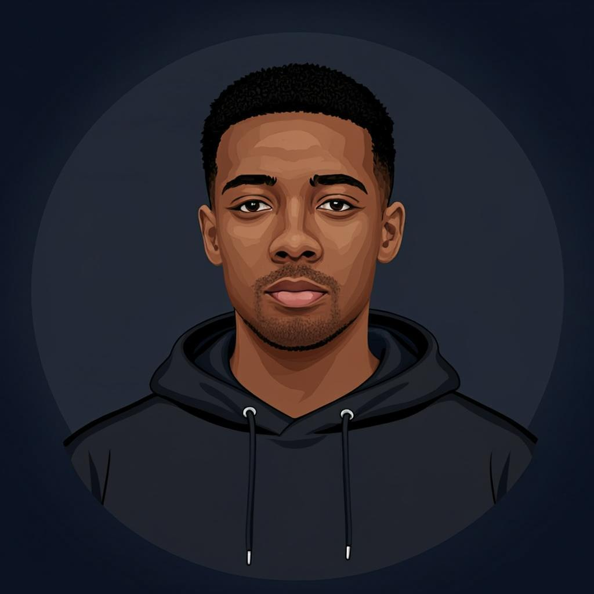

# L3von

**Full-Stack Developer** · Ethiopia 🇪🇹

`Building across the stack — from mobile apps to ML pipelines`

---

### a bit about me

I'm a developer who likes to **build things end-to-end** — from sketching out an idea to shipping it to users. I don't limit myself to one stack or one domain. If there's a problem worth solving, I'll figure out the right tools for it.

Right now I'm deep into **SaaS products**, **real-time systems**, and **bringing AI into practical business tools** — especially for markets in Africa that are underserved by existing software.

---

### what I build

| Project | What it does | Stack |
|---------|-------------|-------|
| **[InvenSync](https://github.com/L3von36/InvenSync)** | Smart inventory management with AI forecasting, POS, and barcode generation for retailers | Next.js · TypeScript · Prisma · Supabase · AI |
| **[CopyCatcher](https://github.com/L3von36/copycatcher)** | Cross-device clipboard synchronization with real-time updates | Flutter · Dart |
| **[Clipboard Sync](https://github.com/L3von36/clipboard-sync-flutter-app)** | Full-stack clipboard sync — Flutter frontend + Django backend with WebSocket | Flutter · Django · WebSocket |
| **[Elite Asset Manager](https://github.com/L3von36/Elite-Asset-Manager)** | Asset management platform | TypeScript |
| **[LoyalEvent](https://github.com/L3von36/loyalevent)** | Event management and loyalty platform | Dart · Flutter |
| **[Real-time Face Detection](https://github.com/L3von36/Real-time-Face-Detection)** | Python-based real-time face detection system | Python · OpenCV |
| **[Event Curator](https://github.com/L3von36/Event-Curator)** | Event curation and management | TypeScript |
| **[WatchParty](https://github.com/L3von36/watchparty-app)** | Shared watch experience app | TypeScript |
| **[Friend Habit Tracker](https://github.com/L3von36/Friend-Habit-Tracker)** | Social habit tracking with friends | TypeScript |
| **[ContactVault](https://github.com/L3von36/contactvault)** | Contact management system | TypeScript |
| **[DevJobs](https://github.com/L3von36/devjobs)** | Job board for developers | Python |

...and [40+ more repos](https://github.com/L3von36?tab=repositories) covering everything from Svelte apps to Jupyter notebooks.

---

### my toolkit

---

### currently exploring

- 🤖 **AI/ML integrations** — making LLMs and computer vision work for real business use cases
- 🏗️ **System design** — scaling SaaS from prototype to production
- 📱 **Cross-platform apps** — Flutter + native bridges
- 🌍 **Tech for African markets** — building tools that actually fit how businesses work here

---

### github stats

---

